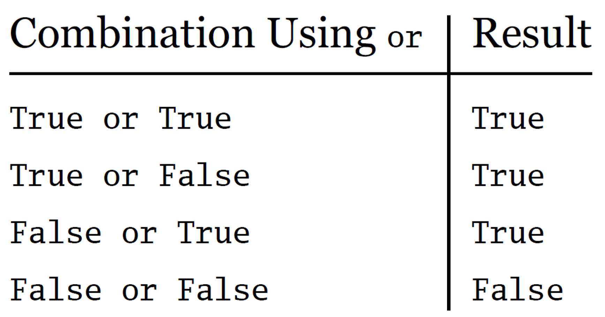

# Komplekse Betingelser med 'and', 'or' og 'not' i Python

## Forklaring

Noen ganger trenger vi å sjekke flere betingelser samtidig for å bestemme hva som skal utføres. For dette bruker Python de logiske operatorene `and`, `or`, og `not`.

- `and`: Begge betingelsene må være sanne for at den samlede betingelsen skal være sann.
- `or`: Minst én av betingelsene må være sann for at den samlede betingelsen skal være sann.
- `not`: Inverterer sannhetsverdien av betingelsen den er brukt med.

Sammenlikningstegnene er de samme som tidligere:


## Eksempler

1. **Bruke 'and'**:

```Python
alder = 20
medlem = True

if alder >= 18 and medlem:
    print("Du har tilgang!")
```

2. **Bruke 'or'**:

```Python
alder = 16
forelder_tilstede = True

if alder >= 18 or forelder_tilstede:
    print("Du kan se filmen!")
```

3. **Bruke 'not'**:

```Python
brukernavn_innlogget = False

if not brukernavn_innlogget:
    print("Vennligst logg inn for å fortsette.")
```

---

### Oversikt over hvordan de ulike betingelsene fungerer

|  |                    |
| ---------------------------------------------------------------------------------- | -------------------------------------------------------------------------------------------------- |
|  |  |

## Oppgave

Se for deg en kortstokk. I en kortstokk har vi fire ulike typer kort, og 13 ulike tallverdier for hver type. Om vi setter ess til å ha verdien 1, knekt til å ha verdien 11, dame til 12 og konge til 13 kan de to listene under representere en kortstokk.

```Python
typer = ["hjerter", "kløver", "spar", "ruter"]
verdier = [1, 2, 3, 4, 5, 6, 7, 8, 9, 10, 11, 12, 13]
```

Vi skal nå tenke oss at man har et kortspill hvor man trekker et tilfeldig kort. Hvilken kombinasjon man trekker bestemmer hvor mange poeng man får ut fra følgende regler:

- Kløver 3 gir 15 poeng
- Alle 10ere og alle sparkort gir 10 poeng
- Alle kort som ikke følger reglene over og har verdi under 10 gir 5 poeng
- Alle kort som ikke følger reglene over og har verdi over 10 gir 12 poeng

---

### Oppgaven

Du skal simulere dette kortspillet ved å skrive et program som skal trekke en tilfeldig verdi fra de to listene over. Programmet skal trekke en type og en verdi.

Kombinasjonen av disse skal bestemme poengene som man får. Programmet skal printe ut hvilket kort som ble trukket og hvor mange poeng du fikk for å trekke det kortet. Poengene bestemmes ved å følge reglene som er listet opp over.

Du kan trekke tilfeldig fra listene ved å bruke `random.choice()`-funksjonen i Python slik:

```Python
import random
liste = [1, 2, 3]

tilfeldig_trekning = random.choice(liste) #trekker et tilfeldig element fra listen
```

---

### Ekstra:

1. Gjør endringer i programmet slik at det kjører i en while-løkke og trekker et nytt kort hver gang man trykker enter, men avslutter programmet om man skriver inn "q".
2. Lag en variabel som teller poengene du får for hver runde og summerer dem. Om du gjør 5 trekninger skal altså summen av de fem trekningene vise i konsollen hver runde.
3. Gjør endringer i reglene slik at reglene i spillet nå blir slik:
   - Kløver 3 gir 15 poeng
   - Alle 10ere og alle sparkort gir 10 poeng
   - Alle kort som ikke følger reglene over gir like mange poeng som verdien til det kortet. Hjerter 12 (dame) gir altså 12 poeng, mens kløver 2 gir 2 poeng osv.
4. Utvid spillet enda mer ved å legge inn muligeten for at man er to spillere som trekker hver sin tur. Programmet må da regne ut summen for spiller 1 i én variabel og summen for spiller 2 i en annen variabel slik at man ahr muligeten til å konkurrere mot hverandre.

---
